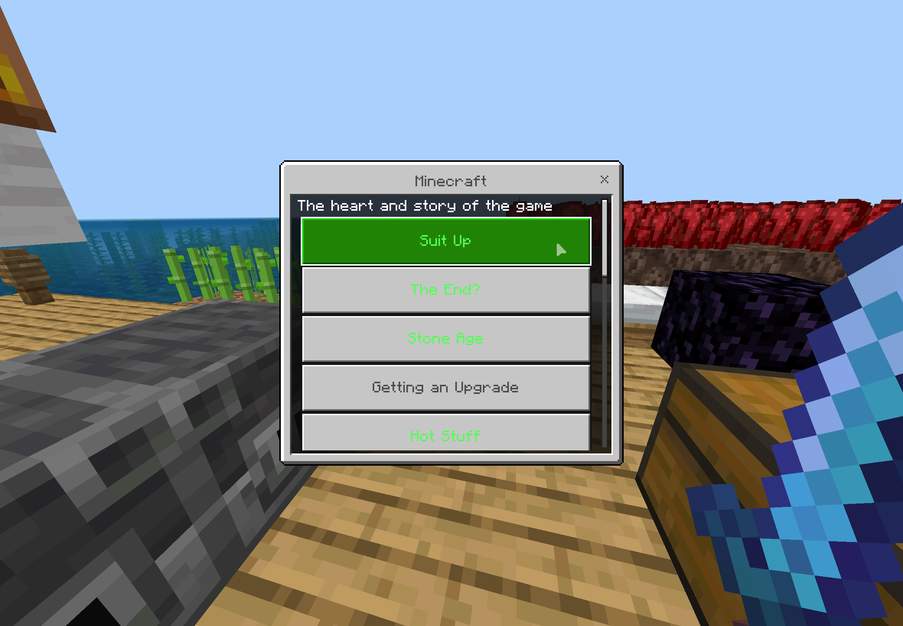
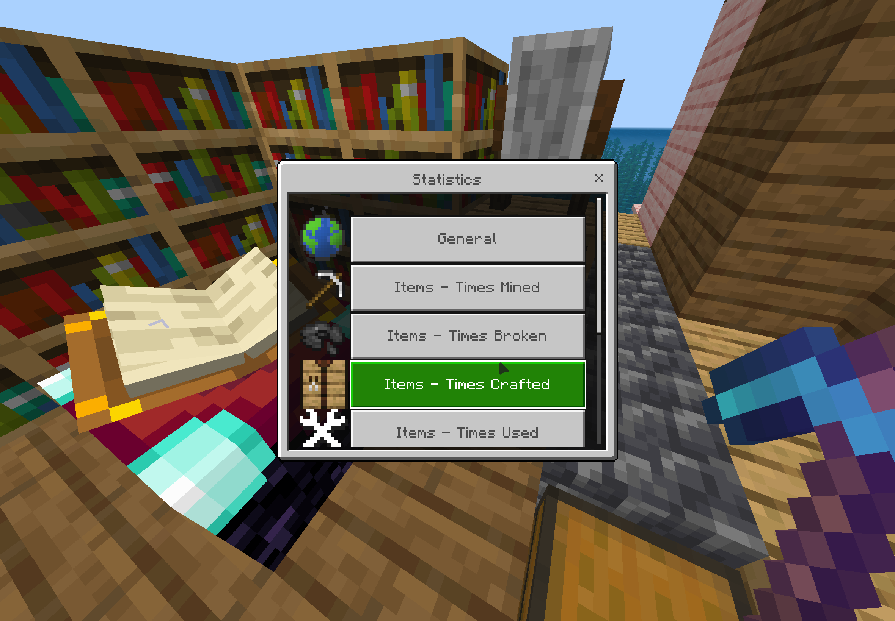
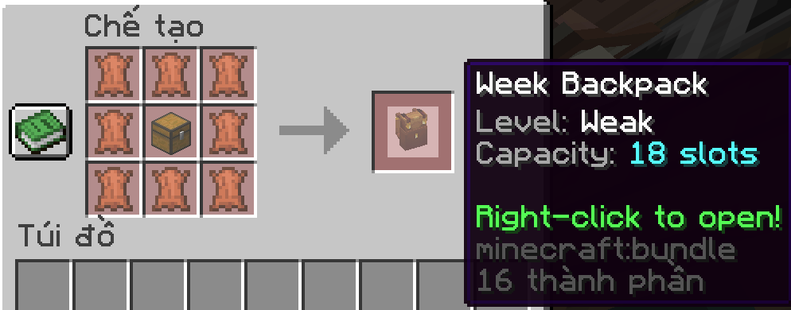
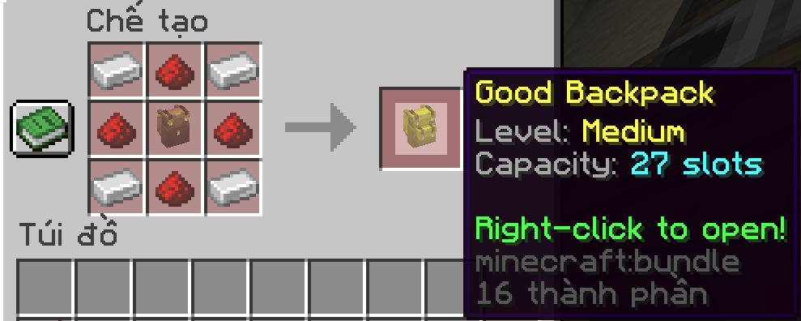
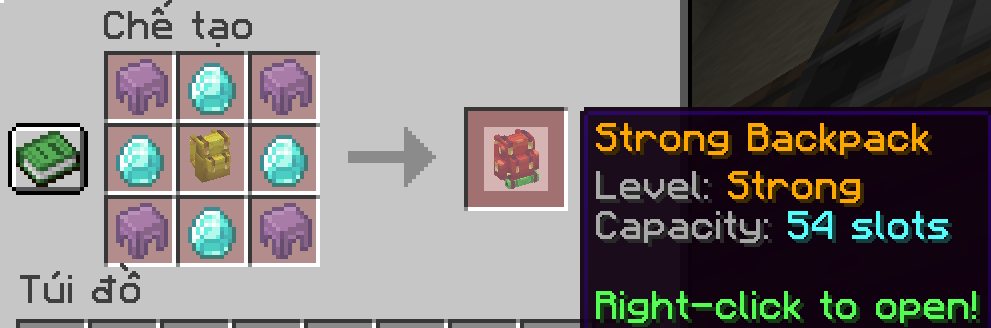

# Aso Server Documentation

## 🎮 كيف تدخل السيرفر
أول شي ادخل الديسكورد من هالرابط:

[https://discord.gg/3cbkPkeMAN](https://discord.gg/3cbkPkeMAN)

ادخل روم #join وبتحصل الـ IP:Port، حطهم بماينكرافت سواء كنت تلعب جافا أو بيدروك.

## 🛡️ نظام حجز الأراضي
نظام عشان تحجز أرضك وأغراضك وتضمن محد يخرب عليك.

كيف تستخدمها:

`/claim`
يحجز الأرض الي واقف عليها باسمك

`/claim auto`
يفعل أو يوقف وضع الحجز التلقائي، ويحجز الأراضي اللي تمر عليها وأنت تمشي

`/claim menu`
يفتح لك واجهة إدارة الحجز الرئيسية

`/claim info`
يعرض لك معلومات الحجز في المكان اللي أنت فيه

`/claim visible`
يظهر أو يخفي حدود الأرض المحجوزة

`/claim abandon`
يحذف كل الأراضي المحجوزة باسمك

`/unclaim`
يفك الحجز عن الأرض الي واقف عليها

`/unclaim all`
يفك الحجز عن كل الأراضي المحجوزة باسمك

مميزات الحجز:

* حماية البلوكات — يمنع التكسير أو البناء بدون صلاحية
* حماية الكائنات والمركبات — يحمي الحيوانات وArmor Stands وItem Frames ويمنع استخدام المركبات بدون صلاحية
* حماية الانفجارات والبستون — يمنع TNT وCreepers ويمنع البستون من الدفع أو السحب عبر حدود الأراضي
* التفاعل والأغراض — يتحكم بالوصول للأبواب والصناديق ويمنع التقاط أو رمي الأغراض بدون صلاحية
* PvP والأوامر — يعطل PvP داخل الأراضي ويمنع أوامر محددة داخل أراضي اللاعبين

أوامر إضافية:

  
Trust - الثقة

   

  `/claim trust add <player>`  
  يعطي اللاعب كامل الصلاحيات وأرضك تصير نفس أرضه

  `/claim trust remove <player>`  
  يشيل الثقة من لاعب

  `/claim trust list`  
  يعرض كل اللاعبين الموثوقين

  
Members - الأعضاء

   

  `/claim member invite <player>`  
  يرسل دعوة للاعب عشان ينضم لأرضك

  `/claim member kick <player>`  
  يطرد لاعب من أرضك

  `/claim member list`  
  يعرض كل الأعضاء ورتبهم

  `/claim accept <name>`  
  يقبل دعوة الانضمام المعلقة

  `/claim deny <name>`  
  يرفض دعوة الانضمام المعلقة

  
Allies - التحالفات

   

  `/claim ally invite <name>`  
  يرسل طلب تحالف إلى أرض ثانية

  `/claim ally accept <name>`  
  يقبل طلب التحالف

  `/claim ally deny <name>`  
  يرفض طلب التحالف

  `/claim ally remove <name>`  
  يفك التحالف الحالي

## 🛒 نظام المتجر

نظام اقتصادي متكامل عشان تبيع وتشتري فيه الموارد والأغراض.

  <a href="shop.md">🛒 اضغط هنا لرؤية شرح مفصل لنظام المتجر</a>

## 🏠 إضافة الانتقال السريع لبيتك sethome
كيف تستخدمها:

`/sethome [name]`
عشان تسوي لك بيت جديد

`/home [name]`
عشان تنتقل لبيتك

`/delhome [name]`
عشان تحذف البيت

تقدر تضيف أكثر من بيت أو مكان عشان يسهل عليك التنقل بالعالم، وتقدر تسمي كل مكان بالاسم اللي تبيه.

أمثلة:

`/sethome farm`
(عشان تسوي نقطة ترجع لها باسم المزرعة)

`/home farm`
(عشان تنتقل للمزرعة على طول)

`/delhome farm`
(عشان تحذف نقطة المزرعة)

## 🌐 أوامر نسخة البيدروك Geyser
أوامر وتوافق عشان تضبط التجربة للاعبين اللي يدخلون من الجوال أو الكونسول.

كيف تستخدمها:

`/geyser advancements`
عشان تشوف الإنجازات اللي خلصتها (Advancements)

  

`/geyser offhand`
عشان تبدل الأغراض لليد الثانية

`/geyser ping`
عشان تشيك على البنق وسرعة اتصالك بالسيرفر

`/geyser statistics`
عشان تشوف إحصائياتك في السيرفر

  

## ✉️ أوامر الانتقال للاعبين tpa
كيف تستخدمها:

`/tpa [Player]`
عشان تنتقل إلى لاعب معين

`/tpaccept`
عشان تقبل آخر طلب انتقال جاك من لاعب ثاني

`/tpdeny`
عشان ترفض آخر طلب انتقال جاك من لاعب ثاني

`/tpacancel`
عشان تلغي طلب الانتقال اللي أنت أرسلته

أمثلة:

`/tpa .iaflzr`
(عشان تنتقل الى اللاعب .iaflzr)

## 🎒 إضافة الحقيبة المتنقلة backpack
عشان توسع مساحة التخزين حقتك وتقدر تشيل أغراض أكثر وأنت تتمشى.

معلومات مهمة:

* تقدر تستخدم حقيبة وحده بس في الانفنتوري
* ما تقدر تحط حقيبة داخل حقيبة ثانية 🤓
* ما تقدر تخزن الدروع والأدوات والكتب داخل الحقيبة

الحقائب المتوفرة:

### Week Backpack - حقيبة ضعيفة
سعة الحقيبة: 18

طريقة الصنع:

  

### Good Backpack - حقيبة متوسطة
سعة الحقيبة: 27

طريقة الصنع:

  

### Strong Backpack - حقيبة قوية
سعة الحقيبة: 45

طريقة الصنع:

  

## ✨ أوامر إضافية

`/spawn`
ينقلك إلى السبوان

`/rtp`
ينقلك إلى مكان عشوائي بعيد

`/nv`
يفعل لك الرؤية الليلية في الظلام

`/statistics`
يعرض إحصائيات اللاعبين مثل وقت اللعب وعدد الموتات

## 🧩 إضافات أخرى:

* نسخة احتياطية يومية للسيرفر لضمان عدم فقد البيانات
* فين ماينر (Vein Miner) — إذا كسرت Ore واحد، راح تتكسر باقي الأورات المتصلة عشان تختصر وقتك
* صندوق القبر — إذا مت، راح تلقى في الشات إحداثيات آخر مكان مت فيه، وأغراضك بتكون محفوظة داخل صندوق ومرتبة
* رؤوس اللاعبين — إذا قتلت لاعب، راح يطيح رأسه بنفس السكن وباسم الشخص، وينرسل تنبيه في الشات
* نوم لاعب واحد — إذا نام شخص واحد، يجي الصباح مباشرة
* تكسير الشجرة بالكامل — إذا كسرت الشجرة بـ Axe راح تتكسر كاملة، لكن انتبه لأنه يستهلك كثير من متانة الـ Axe
